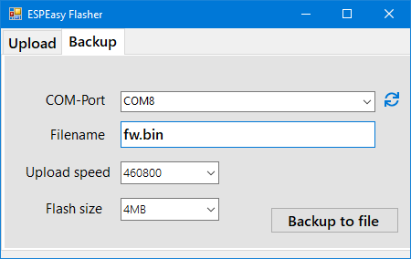

# ESPEasyFlasher

Small and super light UI for Flashing ESPEasy with esptool. .NET 4.5.2 required.
Now supports firmware backup and flash operation, so easy clonning of your running ESP!

## Installation

Go to the [latest release](https://github.com/raomin/ESPEasyFlasher/releases/latest) and get the ZIP file.
Unzip all in one folder (the FlashESP8266.exe and esp-tool.exe must be in the same folder).

## Usage

Launch FlashESP8266.exe.
To Backup pay attention that the Filname must be in .bin to appear in the Flash section.
